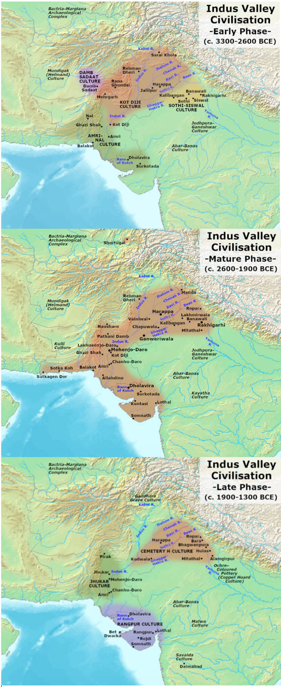
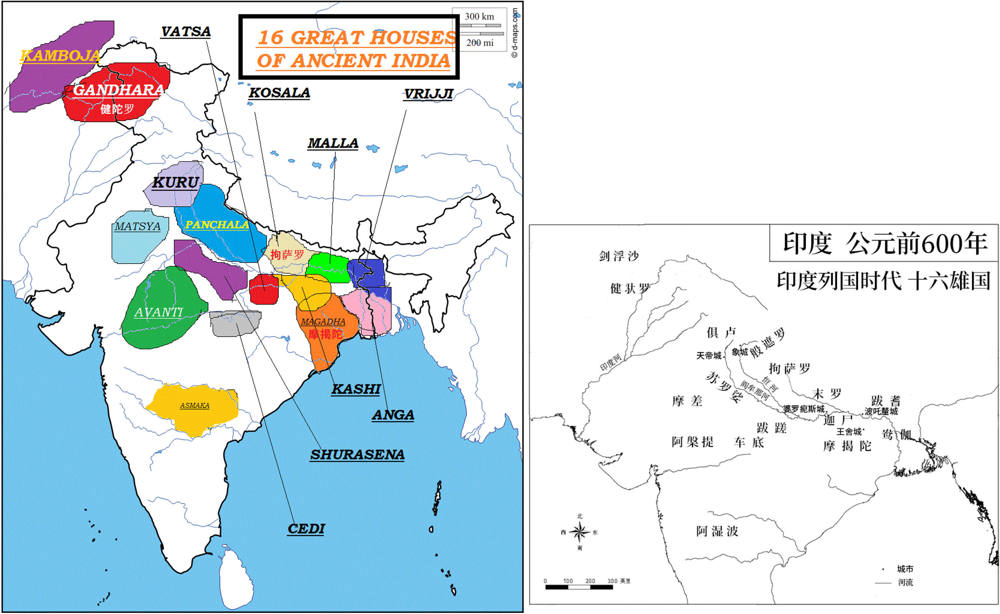
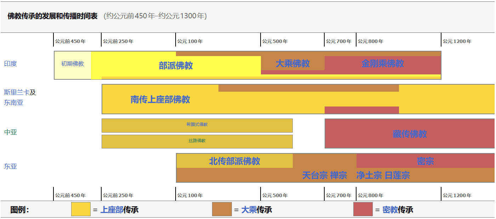
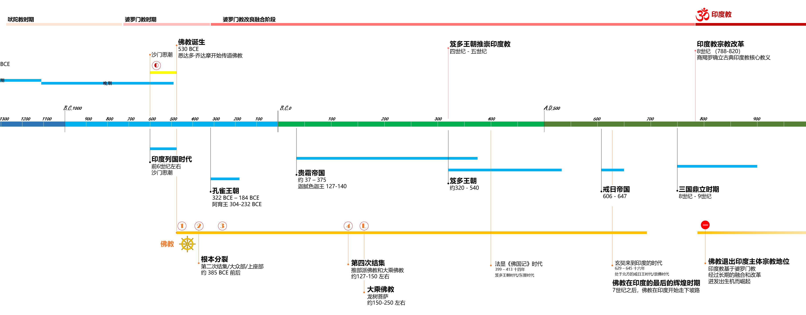
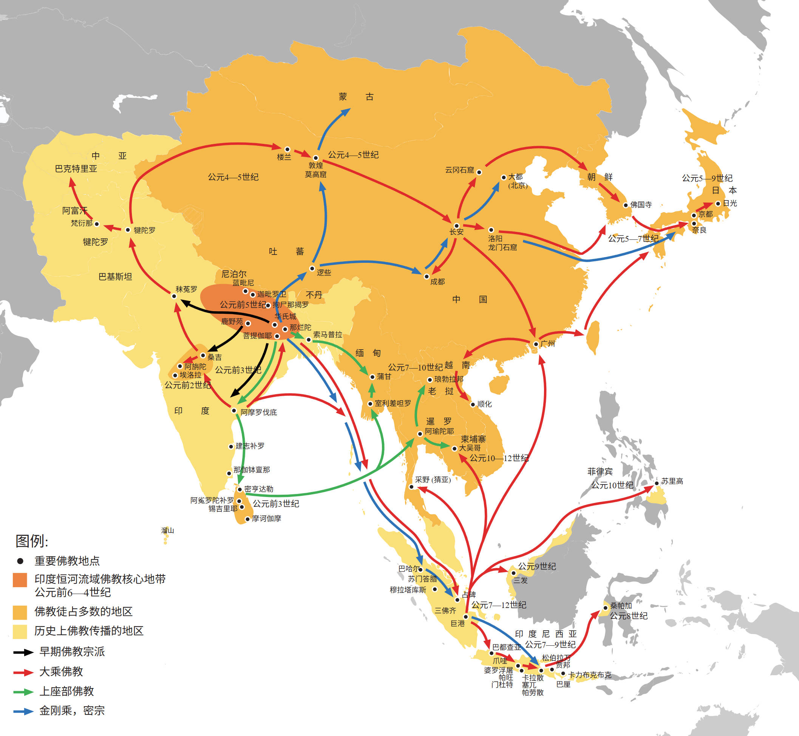

# **01 印度本土宗教**

- [**01 印度本土宗教**](#01-印度本土宗教)
  - [前言](#前言)
  - [佛教核心教义](#佛教核心教义)
    - [**三法印**](#三法印)
      - [**无常**](#无常)
      - [**无我**](#无我)
      - [**涅槃寂静**](#涅槃寂静)
      - [参考 - 上面提到/用到的一些概念](#参考---上面提到用到的一些概念)
      - [时代背景](#时代背景)
      - [三法印的总结](#三法印的总结)
    - [**四真谛**](#四真谛)
      - [逻辑和概念](#逻辑和概念)
      - [参考 - 解释相关概念](#参考---解释相关概念)
  - [印度的文明和宗教发展](#印度的文明和宗教发展)
    - [早期南亚次大陆文明](#早期南亚次大陆文明)
      - [哈拉帕文明](#哈拉帕文明)
      - [吠陀文明](#吠陀文明)
        - [**吠陀教**](#吠陀教)
    - [佛教产生的历史背景](#佛教产生的历史背景)
      - [**沙门思潮**](#沙门思潮)
        - [婆罗门教](#婆罗门教)
    - [佛教早期的传播和分裂](#佛教早期的传播和分裂)
  - [佛教在中国的发展过程](#佛教在中国的发展过程)
  - [佛教在印度的衰落（待续）](#佛教在印度的衰落待续)
  - [印度的后期宗教发展/印度教](#印度的后期宗教发展印度教)
    - [印度教的产生和发展 - 改良和融合](#印度教的产生和发展---改良和融合)
    - [印度教核心教义](#印度教核心教义)
    - [三个主神](#三个主神)
    - [史诗故事](#史诗故事)
      - [《罗摩衍那》](#罗摩衍那)
      - [《摩诃婆罗多》](#摩诃婆罗多)

## 前言
总体而言，印度在不同的历史时期，产生出（也有外来引入）了不同的宗教形式，各自在某些时间段内，占据过核心和主体的地位，它们分别是
1. 早期吠陀教                         （**Verdic**）
2. 基于吠陀教演化出来的婆罗门教         （**Brahmanism**）
3. 基于沙门传统演化出来的佛教          （**Buddhism**）
4. 基于婆罗门演化革新出来的印度教       （**Hinduism**）
5. 阿拉伯文明带来的伊斯兰教            （**Islamism**）
6. 目前，在印度占主体地位的是：印度教

在本文的后续部分，将分为两个部分展开介绍。
- 第一部分，站在佛教的视角，来看待在南亚次大陆上曾经发展出的各个宗教的历史背景和宗教的主要特点
- 第二部分，站在印度教的视角，来介绍它的发展过程和宗教特点

## 佛教核心教义
包括（但是不限于）
- 三法印
- 四圣谛

### **三法印**
佛教试图证明的命题：三法印
- 无常
- 无我
- 涅槃寂静

这三个命题事实上是层层递进的关系，并不是并列的关系，也就是：
先证明无常；再证明无我；最后证明涅槃寂静。
用现在的语言解释这个递进关系就是（逻辑推理过程为）：无常-无我-涅槃寂静 = 知道无常-破除我执着-达到涅槃圆满 = 永恒变化 - 世界虚无 - 心理解脱

为什么？佛教要指明“三法印”？印字是什么意思？（Critical Thinking）
因为：
任何的佛教思想或者经书，无论它是怎么描述的（即便有“如是我闻”，“佛陀当年曾经这么说过”），如果它违背了“三法印”的教义，都不属于佛法。不能被盖章承认，因此“印”字就是这个意思，是印证的意思。
我认为：
这三个法印相对来说是比较朴素的，比较客观的标准。最重要的是，它是比较开放（Open）的标准。因此这也可以让其它人/理论得以被提出和发展。比如中国的禅宗思想著作，也可以被认定为《经》-《坛经》。

接下来看一看：
- 如何通过佛教自己搭建的知识体系来证明这些终极命题呢？
- 佛教的知识/概念体系是什么样的呢？

#### **无常**

使用经验论的方法来证明这个观点。通过对身边事物的观察来证明：一起事物都是不停变化的。
无常，指向的是事物的时间属性。
无常还可以分为“外无常”和“内无常”，我看来意义不大，只要知道它是一个时间上的概念/观念就可以了。

进一步，
佛教使用：因缘/缘起，等等概念，从抽象的“理论”层面证明，事物是变化的

#### **无我**

无我，指向事物的本体属性。
意思是所有的事物（包括物质，思想，规则）都没有背后指挥它们的主体。

佛教使用向下拆分的方法来说明这个概念。比如，
         石头 - 沙粒 - 分子 - 原子 - 质子/中子 - 弦 - 后面可能还有
人 - 大脑 - 神经细胞 - 分子
无我，还可以分为“人无我”和“法无我”，我同样认为这也不重要，只要知道它是一个指向本体上的概念就可以了。

进一步，
佛教使用：成就/因缘假合，等等这些概念来抽象的说明这个理论。
更进一步，
既然没有“我”，所有“物质和精神”背后都没有东西主宰，那整个世界都是“空”的

Q：提出整个观念/命题的背景是什么？
A：佛教诞生之前的“吠陀教”/婆罗门教和之后的印度教（扩展到世界的其它主流宗教：基督教/伊斯兰教/犹太教），都认为“物质/精神”的背后都有非常神秘的力量控制这它们的运行，这个主宰的力量就是“神”，它们把它人格化，就是“上帝”/“弥赛亚”/“梵”。
然而，佛教为了反对“婆罗门”的至高无上（/或者叫装神弄鬼），提出了朴素的哲学/科学观点，指出世界上没有“神”。因此这个背后是一个“无神论”的声明。

#### **涅槃寂静**
这是被佛祖实证的事实？所以信徒才相信？还是过程中，很多信徒/僧侣也达到了这个状态（其它佛/果位等级），所以信徒才相信和向往。信徒追求达到那个“更幸福的状态”，这个状态可能是心理上/哲学上的/世界观上的，而非物质上的。
涅槃寂静的含义：“涅槃”=“烦恼的停止”；“寂静”=“状态是安稳的”。
因此，涅槃是一种状态。是特指“贪嗔痴”的彻底熄灭，并非肉体死亡，因此涅槃有一种是肉体还在的涅槃（有余涅槃），还有另一种肉身消失的涅槃（无余涅槃）
另外，寂静是一个形容词，用来修饰“涅槃”这个表示状态的名词。我理解是外界的影响，不会对内心产生任何的缘起，也就是不会导致内心的任何“波澜”。如平静的水面，即便丢入多少石块，也激不起一丝涟漪，保持一片死寂。

#### 参考 - 上面提到/用到的一些概念

**“缘起”** 是总法则，是一种理论。简单理解为：此有故彼有，此生故彼生。这个普遍规律。
缘起理论，由下面的一些概念构成。

“因缘” 是缘起的组成单元。可以理解为“关系”。
**“十二因缘”**
又称为，十二缘起支。似乎可以简单的理解成“关系”。它们互相为因果，一个因缘升起，也会导致另一个因缘也升起。“此有故彼有，此灭故必灭”

“十一意义”/“十一义”
它是用来解释/总结“缘起”理论的特征的。归纳起来缘起理论有几个特点
- 无神 即无造物主
- 无常
- 无我
- 因果 所有缘起本质上都是因果关系

#### 时代背景
原始佛教诞生于“沙门思潮”时期，目的是对抗当时的“婆罗门教”，反对基于婆罗门的种姓制度下的：地位/权力/话语权/等等 的不平等，来提出的解放和自由的思想。
因此，佛教强调，没有至高无上的“神”，因此也就不需要跟神沟通的祭祀/神职人员，每个人自己就可以达成一种终极的心理上的幸福状态。
世界并不神秘，甚至整个世界都是“空”的，它是被搭建起来的；但是并不代表人类可以最终完全理解这个世界，因为它可以无限拆解下去，并且是随机的，因此是某种程度上的“不可知论”。但是尽管如此，这并不重要，每个人寻求的最终状态，可以靠修行/理解/领悟，每个人都能达到令人满意的不同状态（果位）。

#### 三法印的总结
它是一个标准
- 是佛教学说 or 不是佛教学说（不是正法）

它是一个层次递进的逻辑推理过程
- 先明白无常 / 再破除我执 / 最后达到个人的圆满状态

它是一些基础理论
- 无神论/无造物主
- 无常
- 无我
- 因果关系下的缘起缘灭/因果论

### **四真谛**
四真谛是：苦集灭道，这四个真谛

#### 逻辑和概念

|四谛|逻辑|解释|内容|
|---|---|---|---|
|苦|提出问题|人有种种烦恼|三苦/八苦/等等|
|集|分析总结原因|总结出：贪嗔痴；背后是我执；原因是不明白=无明|业 贪嗔痴/我执/等|
|灭|展示预期目标|大乘认为人人都有机会达成的状态|涅槃寂静|
|道|给出解决方法|通过修行和学习能达成|四念处/八道；六波罗蜜多/等|

也就是四圣谛的逻辑顺序/逻辑关系是：
- 先提出问题=你看人在世间有很多的痛苦和烦恼；
- 总结起来得根本原因是因为（Root Causes）
  - 因为贪嗔痴导致的
  - 因为人没法放弃我执
  - 因为不明白道理（佛法=看世界的“正确”方法）
- 预期达成佛/涅槃是可能的
  - 你看佛祖能达到这样的状态，并且他说人人都能达到更好的状态
  - 涅槃寂静 或者 达到不同果位
- 依靠这样得方法就可以达成预期目标
  - 八正道/等

**Critical Thinking**
到这里可能会问：为什么要提出“四圣谛”？这跟之前的“三法印”有什么关系？那个是佛教的根本？是在什么背景下提出的“四圣谛”？
我的理解和回答是这样的（基于查找的参考资料和我自己的理解），即：
- 三法印，是佛教的理论。是抽象的概念
- 四圣谛，是实践方法。是面向实践的，是面向信徒修行的具体方法。

也就是它们是面向“理论”和“实践”这两个不同领域提出的。
它产生的背景/神话后的背景 是：释迦摩尼在菩提树下领悟了佛法之后，在鹿野苑第一次讲法的时候，讲的是“四圣谛”。也就是佛教开始传播的时候，已经想好了如何让信众学习佛教的方法。这里并不一定是一个人想出来的方法，也不一定是当时就已经非常完善的方法，这里的核心是，佛教准备好传播的一个条件是：身处在佛教诞生时候的社会情况，各种知识背景/学习能力/经济条件不同的潜在教徒，如何让他们更清楚具体的明白如何操作。以上是我的观点和猜测。

因此，“三法印”和“四圣谛”都很重要。一个是思想理论，是佛教立足的思想基础；一个是实践方法，是佛教能够得以传播和扩张的基础。
也就是它们的关系是：相信什么？& 做什么？ 做什么跟相信什么是密切相关的。

#### 参考 - 解释相关概念

**六波罗蜜多=六度**（这个是从梁文道的视频中听来的）
- 布施 / 持戒 / 忍辱 / 精进 / 禅定 / 般若

注意！OBS！Note！
这里的“六度”跟稻盛和夫的“六项精进”是完全不同的。稻盛和夫的六项精进是他自己总结经验阐述的要在工作和生活中的6种努力改进的地方。这里容易混淆的是数字6和精进都是有的，是交集的地方，但是概念和目的完全不同。

道谛（包含）
- 修道的层次
- 修道的方法
  - 四念处：身/受/心/法 （念处）
  - 八正道：正见/正思维/正业/正语/正命/正勤/正念/正定

苦谛（包含）
- 苦处
  - 友情世间：六道/三界
    - 六道轮回：即生物在六道轮回，天/人/阿修罗/畜生/饿鬼/地狱（完全胡说）
  - 器世间：物质世界
- 苦相
  - 三苦：苦苦/坏苦/行苦
  - 八苦：生老病死+爱别离/求不得/怨憎会 + 五取蕴苦

集
- 业
- 烦恼：贪嗔痴

灭谛
- 无明烦恼（去贪嗔痴，去我执）；涅槃寂静

五蕴
- 色/受/想/行/识
- 是对世界上物质/关系/运行的一些归类（非常低浅的认识）

六根/六尘
- 六根器（感受器官）：眼耳鼻舌身意
- 六尘是六个感受器感觉道的内容：色声香味触法

三宝
- 佛宝/法宝/僧宝
- 佛宝=佛祖=释迦摩尼；法宝=佛法=三藏十二部经等；僧宝=信徒=僧人

菩提萨陲/菩提萨埵
- 菩提/Bodhi：觉悟(的)
- 萨陲/Sattva：有情，众生 = 修行者
- 合在一起的意思可以理解为：觉悟的修行者。

**三藏十二部 V.S. 佛教十三经**
- 三藏十二部
  - 并不是说一共由十二部经书。而是将经书按照叙述的形式和内容，分成十二个类别。
- 佛教十三经
  - 民间为方便大众学习佛教，从浩瀚的佛经中精选的十三部经书，包括
    - 《金刚经》《心经》《六祖坛经》《法华经》
    - 《无量寿经》《药师经》《地藏经》《楞伽经》《金光明经》《四十二章经》《圆觉经》《维摩诘经》《楞严经》

**想要深入了解佛教核心教义的内容，需要将佛教带回到它诞生的时代，在时代的背景下尝试了解佛教思想的由来。**

## 印度的文明和宗教发展

### 早期南亚次大陆文明
注意：下面的时间都是BCE的时间

- 梅赫尔格尔/（**印度新石器时期**）
  - 7000 BCE - 3300 BCE 
  - 达罗毗荼人，这些人跟后期的哈拉帕文明是同样人群，发展的不同阶段
- 印度河谷文明/哈拉帕文明/Harappan Civilization（**印度青铜器时代文明**）
  - 3300 BCE ~ 1300 BCE 
    - 3300-2800 BCE 早期哈拉帕
    - 2600-1900 BCE 成熟哈拉帕
    - 1900-1300 BCE 晚期哈拉帕
- 后哈拉帕文明
  - 第一阶段
    - 1300-600 BCE 彩绘灰陶文化
    - 1500-500 BCE 吠陀文化（时间跨度更大）
  - 第二阶段
    - 600-300 BCE 北方黑彩陶（**印度铁器时代文明**）
    - 500-200 BCE 印度第二次城市化

#### 哈拉帕文明

可以简单的认为，哈拉帕文明和梅赫尔格尔都是由拉罗毗荼人发展出来的文明，只是发展程度不同，两者是内部发展和延续的关系。两个文明的主要区别是
||梅赫尔格尔文明|哈拉帕文明|
|---|---|---|
|标志|新石器时代|青铜时代|
|聚集形式|村落|城市/城邦|
|阶级分化|无明显阶级分化|由明显阶级分化|
|区域范围|较小|较大范围跨区域文明|

哈拉帕文明不同阶段（早/成熟/晚）的分布情况示意图如下（参考wikipedia）
  

    
  

哈拉帕文明有个重要的特点就是：他们几乎没有留下书写文字。
这是跟后面的吠陀文化的一个显著的区分。也就是没有留下关于那个时代的任何文字记录。
但是，这些后来被雅利安击败的拉罗毗荼人，后来迁徙到印度的其它地方（南部印度/甚至斯里兰卡），建立了延续近1000年的民族国家，在这些国家中，他们发展了自己的语言和文字，也让民族得以延续。

#### 吠陀文明

提前的说明：“雅利安”这个名词因为德国纳粹的污染以及历史原因造成的不准确性，应该改为类似“印欧人”这样的说法。
但是后面还是有很多带有“雅利安”这样的提法，是沿用历史说法，因为在吠陀文化的书籍《吠陀》中，他们称呼自己是Arya/雅利安人，因此，在后续阅读时候需要特别注意！

时间来到公元前大约公元前1500年（也可能更早或者更晚，1900 BCE或者1300 BCE），
印度-雅利安人陆续来到南亚次大陆，他们是从草原游牧民族演化来的民族和部落
- 颜那亚文化圈
- 安德罗诺沃文化圈
- 伊朗-雅利安人的分支印度-雅利安人进入BMAC文化体，吸收文化
- 印度-雅利安人进入南亚次大陆北部（印度河上有一带）

下图所示就是这个民族/人种迁徙的过程
  

    
  

早已在本土生活很久的帕拉哈文明的拉罗毗荼人，之前一直靠季节性的降水来从事农业耕种，因为长期干旱的自然条件，并且他们没有发展出灌溉系统，因此文明正逐步走向衰落。

因此，当这些草原民族（印度-雅利安人）进入印度和上游的时候，也就是大约1500 BCE ~ 500 BCE的时候，利用他们草原文明的半游牧半耕种的生活方式，以及从草原带来的战车和骑兵，以压倒性的优势，迅速击败了之前的本土民族拉罗毗荼人，建立起来了吠陀文化。并且从印度河上有逐步向东扩张到恒河上游一带。

  

    
  

经过了这些扩张之后。
吠陀人/雅利安人在恒河平原完成从游牧到农耕的转变，铁器技术普及后诞生出了新一轮全新的城市繁荣（*第二次城市化*）。

##### **吠陀教**
**误解之一**：种姓制度

吠陀教是在1500 BCE 雅利安人进入南亚次大陆的时候带来的宗教和信仰。我之前常常误解，以为吠陀教带来了严格的等级划分/种姓制度，但事实上，早期的吠陀教并没有严格的种姓或者阶级。仅仅区分雅利安人（高贵者）和达萨（被征服者）。在雅利安人的内部，有职业的分工，祭祀/武士/平民等不同职业之间是可以流动的。

到了吠陀时代的后期，随着社会复杂化，《梨俱吠陀》末期的《原人歌》首次提出了四大瓦尔纳（Varna，意为颜色/阶层）：婆罗门（祭司）、刹帝利（武士/君主）、吠舍（平民/商人）、首陀罗（土著/奴隶）。此时阶级开始固化，但主要是一种宏观的阶级形式。

但是在吠陀时代后期，开始出现了显著的形式分化，婆罗门开始萌芽。
- 在西北部（印度河上游，恒河平原西部），在这里是雅利安人最早进入的区域，也是核心地区，发展出了森严的等级，极度复杂的仪式，婆罗门势力极大，借此发展出了婆罗门教。衍生出了当时的种姓制度Jati（扎蒂）这是印度现在本地的叫法，英语叫做Caste（卡斯特）。现在印度的种姓制度早已经非常复杂，远远超过当时的情况。
- 在西南部（恒河平原东部），这里还存在着大量的本土居民，并且雅利安人把这里看作偏远的地区，并不大愿意去这里生活，因此吠陀思想和婆罗门影响较弱。这里通过贸易暴富的吠舍（商人）和掌握国家军政大权的刹帝利（武士/君主），逐渐越来越难以忍受婆罗门（祭祀）的高傲和在种姓上对他们的压迫。于是，东部爆发了著名的“沙门思潮（Sramana movement）”。一群不承认吠陀权威、反对婆罗门至上、反对杀生祭祀的苦行僧和思想家纷纷涌现。佛教（释迦牟尼，刹帝利出身）和耆那教就是这股反叛思潮中最成功的两支。佛教主张“众生平等”（至少在修行上），极其迎合当时东部商人阶级和新兴君主的需求。

**误解之二**：神祇崇拜

原始的吠陀教是多神教。服务于原始的功利目的，比如求风雨，太阳神等。主要的神祇有33个，分为天/空间/地三个类别。非常类似希腊/罗马和北欧原始神话中的众神系统。
- 因陀罗，类似宙斯
- 阎摩，类似死神
- 特尤斯，天空之父
- 等等

我以前的误解是，以为像梵天/毗湿奴/湿奴这些后来在印度教中的主神，是从吠陀教中继承过去的原有的大神。事实上，在吠陀教中，几乎没有这些神，或者仅仅是非常微末的小神。这些在印度教中的神祇事实上是吸收了很多本土文化中的神，是一个本土化的适配结果，以便印度教能够更好的被当地大众所接受。

**核心经典**

所有经典都口口相传的方式传承，后来才整理成梵文版本
- 《梨俱吠陀》 赞颂众神的1028首颂歌，是吠陀教的基础来源，在1500 BCE左右流传和编纂
- 《娑摩吠陀》 祭祀仪式配套吟唱曲调，以及后面的2个经典，在1200-1000 BCE 开始编纂
- 《耶柔吠陀》 祭祀仪式操作手册
- 《阿闼婆吠陀》 咒语
- 其它经典
  - 《奥义书》
  - 《梵书》《森林书》

接下来，我门将要进入的就是佛教的崛起阶段，与此同时，这也伴随着婆罗门教逐渐走向衰落的过程。

### 佛教产生的历史背景

**背景一：印度战国时代**
之前曾经提到过，伴随着第二次城市化过程，16个大国诞生并兴起，从此进入了“*十六大国时期*”。
（电子地图参考链接 https://suttacentral.net/map?lang=en）

了解佛教的诞生，就要结合当时的两个主要时代背景：“十六大国时期”和“沙门思潮”

  

    
  

**背景二：出生和出身**

以下为**Critical Thinking**部分（以正视听）

王子抑或是贵族
- 佛教的创始人-悉达多·乔达摩，出生的年代不详，有多种说法（比如565-486 BCE多被引用，也有南传佛教认为的623-544 BCE，等等），但是大体在16大国时期（印度列国/战国/16-great-houses时代），当时有四个比较强大的王国：瓦特萨（Vatsa），阿凡提（Avanti），拘萨罗Kosala，摩揭陀Magadha。悉达多是出生在拘萨罗下面的的一个小属国/城邦/城市，名叫迦毗罗卫城。这个小的附属国承认拘萨罗为其宗主国，拘萨罗采用君主制的治理方式，但迦毗罗卫国采用的是共和国的方式治理，也就是它的国王是通过推举的方式产生的，并非继承的方式。
因此，常常说悉达多是该国的王子，这就很可能不准确。因为王位并不世袭。但是他的父亲可能是贵族寡头中的一个，很可能身份和地位比较高，因此“王子”的称呼很可能是为了美化佛教，宣称佛祖舍弃一切，创立佛教。

另外，关于“**沙门传统**”
- 悉达多所出生的迦毗罗卫城是释迦族建立的共和国，释迦族是并不属于雅利安的原始当地民族，这是释迦族的身份背景，因此他们并不接纳外来的吠陀宗教以及基于此发展出来的等级森严的婆罗门教。
- 在吠陀经典《梨俱吠陀》中有关于托钵僧和从事冥想的人的记录。因此“沙门”的传统是比吠陀更早或者同期的传统，它是和吠陀/婆罗门并存的本地传统，并非源自吠陀教，是早已存在于南亚次大陆东北部的古老的（很可能比吠陀更古老的，前雅利安的）上层阶级的宇宙学/哲学/宗教。耆那教（qí nà）和佛教都基于“沙门传统”演化而来，并不突然的原创。

**背景三：**
#### **沙门思潮**

其实上面的“沙门传统”应该放在这个环节，但是同时它们也都属于容易混淆/容易误解的部分，且逻辑顺序不冲突，所以暂时放在上面Critical Thinking上，不做调整。

##### 婆罗门教
（这里希望插入一个超级连接/块链接，单独介绍婆罗门教的md文件或者block）
婆罗门对佛教产生主要的作用在于，佛教或者沙门思潮主要的反对对象就是婆罗门教。反对它的种姓制度。
婆罗门教是从吠陀经发展而来的宗教，因而没有创始人。以吠陀教的《吠陀经》为核心经典。
它的核心教义是
- 吠陀天启    也就是《吠陀经》是神的旨意，是至高无上的圣典
- 祭祀万能    通过复杂精密的祭祀仪式，只要仪式正确，甚至可以主宰神明/神明也要听命于祭祀
- 婆罗门至上  种姓制度，婆罗门主要是祭祀

由此可见，婆罗门利用《吠陀经》构建了一套极其有利于自己的教法制度，凌驾于一切之上，在其它种姓之上，甚至可以在神之上，他们想永生永世做世间的神族。这种不平等，当然会引起原著民族的强烈反对，进而引发了沙门思潮运动。

回到上面的16列国的地图，列国分为东西两个大的区域，在西部区域，因为是雅利安人的核心区域，这里婆罗门更加盛行；在东部的区域，原住民族建立的列国中，因为反对婆罗门教，统治阶层的刹帝利和富裕的吠舍阶层，需要一种另外一种意识形态，让自己摆脱婆罗门教的束缚，希望摆脱在政治上的干预，减少对婆罗门在经济上的支出负担，因此在他们的支持之下，在普遍的民间沙门传统基础上，在东部列国中孕育产生了“沙门思潮”运动。

沙门思潮的主要内容包括
- 反对吠陀权威         反对《吠陀》是神启/是真理            <= 没有神，人是自己的主宰
- 反对血祭和复杂仪式   主张不杀生和内心修持                 <= 经济成本过高
- 反对种姓决定论       主张个人行为决定命运                 <= 没有阶级固化，个人的努力能够实现阶层跨越
- 追求个人解脱         提倡苦行/思辨/道德的方式摆脱轮回     <= 痛苦的生活现状和惨烈的列国间战争让人迷茫绝望

从上面可以看出来，沙门思潮，完全是为了解决当时的社会矛盾而产生的，并且有广泛的社会基础，从底层人民，到中层商人，再到顶层的统治者的问题都能解决。

往往在矛盾极大的社会环境下，在乱世之下，才能迸发出丰富的思想火花，解决当时的社会问题，照亮世界前进的方向。沙门运动所处的时代是公元前6世纪-前5世纪这个时代，也是被称为世界“轴心时代 Axial Age”的时代，同时期在古希腊，出现了柏拉图/苏格拉底/亚里士多德等等一大批思想巨匠，在东方中国，出现了孔子/老庄/等等诸子百家，春秋战国时期是百家争鸣的时代。

如果思想不能解决当时的问题，如果思想不具备广泛而长久的适应性/泛化能力，它就不能保持长久的生命力，就会在历史的长河中被湮灭。

在这样的社会背景下，佛教在沙门思潮中脱颖而出，成为了社会的一种集体选择。

**背景四：经历**

悉达多·乔达摩虽然出生在迦毗罗卫城（蓝毗尼园），但他的游行说法传教在摩揭陀国的时间很长。他自己的足迹中包括下面的内容
- 35岁时候在菩提树下悟道成佛，菩提树@菩提伽耶，是古摩揭陀的伽耶城附近
- 第一次转说法（第一次转法轮）是在鹿野苑，它属于古迦尸国Kashi/Kasi首都附近的皇家鹿苑
- 80岁圆寂在拘尸那耶罗的娑罗双树之下，拘尸那耶罗是古末罗国首都近郊
  - 佛教四圣地
    - 上面三个地点，再加上悉达多诞生的迦毗罗卫国的蓝毗尼园
- 传教主要在当时的两大强国摩揭陀和拘萨罗，以及恒河平原附近的国家
  - 王舍城@摩揭陀国都城
  - 舍卫城@拘萨罗国都城
  - 在摩揭陀国时间最长，包括在“竹林精舍”和“灵鹫山”

这里再补充一点，这里的摩揭陀，可以按照中国古代的“秦国”的地位来理解，最后就是摩揭陀几乎统一了印度半岛全境，统一各个列国，击败了亚历山大的希腊入侵，建立了第一个统一的国家，即孔雀王朝。

**五：早期核心教义**

据称（参考南怀瑾的说法，三转法轮=佛陀悉达多曾经三次针对不同水平的学生因材施教的针对四圣谛这个核心教义讲解了三次，称为三转法轮，南怀瑾的原话是：“佛说法严格算来只有三转法轮（三转轮）：小乘声闻道讲四谛法门，中乘缘觉道讲十二因缘，大乘菩萨道讲六度万行”）佛教的诞生初期，最核心的教义是
- 四圣谛          ---- 核心纲领
- 十二因缘        ---- 理论基础（会推导出“空”这个结论）
- 六度/八正道     ---- 行动指导

因此，这也印证了佛教的“诞生”的定义，其实就是适应性的对信徒给出一个基于他们熟悉的“沙门传统”的一个新理论，去对抗和反对婆罗门教，并且这个新理论一定是“可操作的”/“可实现的”，这就是为什么强调
- 十二因缘      <= 理论基础，一切都是变化的，没有固定不变的“阶级”和“婆罗门”
- 四圣谛        <= 核心纲领，一个可实现的框架，可以解决这个问题的信心
- 六度/八正道   <= 如何具体操作，就能因人而异的达成这个目标

**【五-附录】 插播 小作文-读后有感 / 用于刨析和复盘**

同时（*Critical Thinking*），这个事情也告诉我们几个Facts
- （一）南怀瑾说这个话的背景和目的是 **“反教条主义”** ，他想告诉无论是佛教徒也好还是其他人，不要纠结于佛教经典/经书。那里面的每个字不是金科玉律，也不要故弄玄虚，拿起本本查字典，而是要回到佛教创立时候的初衷和当时的方法。也就是回到佛陀当时纯粹，务实的方法中去。也就是1指出人生“苦”，2苦的原因是什么？3给出可以达到解脱的盼头，4只要按照指导手册去操作就能达成（这四个方面就是，四圣谛，苦集灭道）。针对不同背景的人，用不同的话来解释说明，要达到让别人懂得佛法的道理才是最终的目标，而不用拘泥于非要使用什么特定的办法。
- （二）**文字/语言**： 在佛教诞生的初期，都是没有经典的。我这里提到这个的目的也是想支持不要本本主义的教条的方式去理解佛教。第一次集结和第二次集结的时候，都是口传佛教。在后续的佛经中常常看到以“如是我闻”开头的佛经，他的意思是：“我当时听佛陀这么说的”。是弟子阿难因为记忆力超群，在集结的时候来口述，在场的其它信徒/弟子来听证并确认“是/不是”。在第三次集结的时候，才由当时的**阿育王**组织编写经书，使用的语言很可能是当时的摩揭陀语言来写的。并且因为悉达多很长时间在摩揭陀传教，只有使用摩揭陀语言和底层百姓都明白的俗语等才能更有利于传播思想。佛教的经典（三藏十二部）在不同时期曾经使用不同的语言来记录，比如
  - 半/摩揭陀语言。 是在第三次集结的时候，很可能曾经采用的语言。因为当时的阿育王是处于孔雀王朝的时代，而孔雀王朝是从原来的摩揭陀王国（难陀王朝）中崛起的力量。因此是说古摩揭陀语言的。佛教最初用摩揭陀语来记录也是非常合理的。
  - 孔雀王朝“普通话”。为了便于传播，事实上书写和背诵经文所用的语言是一种“被重新创造的复合体语言”，类似于当时僧侣创造的“普通话”，它由摩揭陀语，中西部方言，部分梵语组成的一种“标准语言”。
  - 原样封印。阿育王的儿子（摩哂陀）将在摩揭陀都城华氏城刚刚编制好的佛经带去古斯里兰卡等南方国家。摩哂陀坚持不将佛经转译成当地语言。而是让当地僧侣按照这种僧侣普通话的发音来念诵经文，因而能够完整的保留下来现存最“地道的”最古老的经文。注意，摩哂陀带去佛法的方式是靠一个僧侣团，每个人将经书记在头脑中，去到古斯里兰卡的时候，人肉背诵这些经文。而这种“标准化”的语言跟当地人所说的古代斯里兰卡语言和文字完全不同，僧侣们日常生化用他们当地的语言，而在背诵经文的时候则采用这种“外语”来背诵经文。
  - **贝叶经**。公元0年附近（约29 BCE），斯里兰卡遭到惨烈的入侵和饥荒。很多精通背诵经文的僧人成批饿死，斯里兰卡僧团（大寺派）惊恐之余，决定打破佛陀当年“只许口传”的禁忌。他们召集了残存的高僧，在斯里兰卡的马图莱（Matula）将这些靠耳朵听、背诵了四百年的“印度佛教普通话”语音，一字不差地用文字写在了贝多罗树叶上（即贝叶经）。这就是人类历史上第一部写成文字的大藏经——《巴利语大藏经》（南传五部阿含）。
  - **巴利语**≠不是一种语言=“拼音系统”。当年斯里兰卡僧人落笔时，用的是古斯里兰卡的文字（婆罗米文/僧伽罗文），来拼写“印度普通话”的发音。字母是斯里兰卡的，但读出来的音和字意完全是古印度的，这就是创造出来的“巴利语”。正因如此，当巴利语佛经后来传到缅甸、泰国、柬埔寨时，缅甸人就用缅甸字去拼写巴利语，泰国人就用泰文去拼写巴利语。到了近代，西方学者甚至用拉丁字母（英文字母）去拼写巴利语。
- （三）**禅宗智慧**： 六祖慧能创立南派禅宗，但是他实际上是一个不识字的人。曾经有个故事，讲的是他与当地一个法号叫做“无尽藏”出家尼姑的对话。无尽藏本想问慧能经书中的字怎么念和什么意思。慧能说：“字即不识，义即请问”。得知慧能不识字不会看经文的时候无尽藏不禁发问道：“字尚不识，曷能会义？” 意思是字都不认识，怎么能明白它的意思呢？慧能答道“诸佛妙理，非关文字”（佛法的道理，跟文字没有关系）。从而也引出了“因指见月”这个常被后世禅宗引用的譬喻。慧能用这样的比喻来说明佛经和文字之间的关系，即，月亮在那里，有人用手指着月亮，顺着手指的方向，别人因而见到了月亮。但是手指并非月亮本身，要看见月亮，不一定要执着于那根手指，而应该关注/回归到事物的根本上去。
- （四）**总结/引出我的观点和结论** 所以，我认为：忽略本质和目标，过于关注表面的形式或既定流程，这样的问题时常出现，应并尽量避免。【作者注：也就是我的观点是：不要...怎样怎样...，因此后面需要尽量配合一个：要...怎样怎样...逻辑才会更完整，当然这不是必须的，观点可以仅仅是一个批判性的观点。】（**扩展**）很多时候，在一个行业中，当一件事已经被前人做过之后，形成了“知识”或者“规范做法”之后，后人就会遵循这个方法来解决问题。当别人提出不同的处理意见的时候，会被看做是“外行”或者“错误”的方法。当今世界两个最具创造性的企业家针对这种情况都给出了类似的警告并提出了自己的方法。苹果的创始人史蒂夫乔布斯（Steve Jobs）用“Stay foolish，stay hungry”来作为座右铭，并且在工作中持续挖掘问题的本质，挖掘用户更本质的需求，从而找到跟之前完全不同的解决办法；Tesla和Space-X的创始人埃隆马斯克（Elon Musk）使用“第一性原理”，不断向下挖掘事物背后更本质的问题和原则，以解决问题为目标，以最底层的物理学原理为基础依据，常常能找到出人意料的更好的结果，比如以更低的成本来制造可回收的火箭。【作者注：下面将要给出个人的解决办法】对于我们个人而言，因此受到的启发，或许我们能做的是：在平时/日常的学习和生活当中，时常停下来总结以下跟目标之间是否渐行渐远，是否对问题进行了更深入的探究去寻求背后更本质的东西了。通过这样做，虽然不一定能够取得像之前提到的人一样的成就，但是会变成一个更好的自己，这不也是一个重要的收获么？

**六：回顾总结**

简单的来理解佛教产生的背景，可以罗列出下面的关键信息
1. 古印度16强国时代，东北部存在婆罗门势力较弱的强国独立发展，比如拘萨罗和摩揭陀
2. 也正是基于这些东部强国崛起和统一印度，才造就后期佛教广泛传播的政治基础
3. 在东部诸多强国中出现了沙门思潮以反对婆罗门教为最大的特点，并都基于本土原始的沙门传统发展而来
4. 沙门思潮迎合了最广大的非婆罗门教人群的支持
5. 佛教等其它宗教在沙门思潮中脱颖而出，成为主流思想和宗教之一
6. 佛教创始人受到拘萨罗/摩揭陀等诸国的欢迎，在这些列国中进行传播
7. 早期的佛教核心思想简洁而直接，目的是为了解决各个阶层的问题，并具备了广泛传播的适应性和可操作性

### 佛教早期的传播和分裂

据称，佛陀（释迦牟尼=释迦族的圣人，也有说叫做斯基泰的圣人的说法）在公元前486年去世。
那段世间里，站在佛教发展的视角来看佛教与当时印度世界发生的历史事件之间的关系，梳理出的简单时间线如下
- **十六大国对峙与沙门运动爆发**
  - 前6世纪初 - 前5世纪中
  - 16国并立，四强国崛起
  - 摩揭陀建立霸业：频婆娑罗王（Bimbisara），哈里王朝通过联姻吞并迦尸国部分领土，并修筑王舍城。他与佛陀结为好友，大力资助佛教僧团。
  - **沙门崛起**：释迦牟尼与大雄（耆那教创始人）在此时期活跃于摩揭陀、拘萨罗与拔耆共和国之间。
- **阿阇世王兼并战 和 第一次结集**
  - 492 BCE - 460 BCE
  - 血腥兼并：频婆娑罗王之子阿阇世王（Ajatashatru）弑父即位。他发明了投石车与战车，展开激烈的兼并战争：
    - 击败强大的北方宿敌拘萨罗国；
    - 历经15年战争，利用离间计攻灭了拔耆共和国与末罗国。
    - 东部统一：摩揭陀一跃成为东部恒河流域的绝对霸主。
  - 佛教事件：**佛陀涅槃**，阿阇世王资助了在王舍城举行的**第一次弟子结集**。
- **幼龙王朝与迁都华氏城**
  - 413 BCE - 345 BCE
  - 迁都华氏城：将首都从山谷中的王舍城迁至恒河要冲的华氏城（Pataliputra），此处后来成为庞大帝国的政治经济中心。
  - 彻底消灭阿槃提：摩揭陀吞并了中西部的强国阿槃提国（Avanti），扫清了统一中印度的最后障碍。
  - 佛教事件：阿育王祖辈时期，僧团在毗舍离举行**第二次结集**，佛教正式分裂为**上座部**与**大众部**。
- **难陀王朝：极为富有与专制的极权统治**
  - BCE 345年 - BCE 322年
  - 低种姓建立帝国：出身贱民（首陀罗）的摩诃钵特摩·难陀建立难陀王朝（Nanda Dynasty）。
  - 扫平旧贵族：难陀王朝彻底摧毁了北印度残存的所有传统刹帝利王族和婆罗门贵族势力，建立了极度集权的官僚与庞大军队体系。
  - 局势：此时摩揭陀已几乎控制了整个恒河流域，但由于暴政与重税，内部怨声载道。
- **亚历山大东征与印度西北变局**
  - BCE 327年 - BCE 325年
  - 外敌入侵：马其顿国王亚历山大大帝率军队攻入印度西北部的犍陀罗和旁遮普地区。
  - 影响：亚历山大虽因士兵抗命退兵，但他摧毁了西北部原本割据的许多小王国，造成了西北部的政治真空，同时也为日后希腊文化与印度文化的碰撞（犍陀罗艺术）埋下了伏笔。
- **孔雀王朝建立与北印度统一**
  - BCE 322年 - BCE 298年
  - 月护王崛起：出身平民的旃陀罗笈多（Chandragupta Maurya，月护王）在谋臣导师卡乌蒂利耶（Chanakya）的辅助下，借助反抗希腊残留驻军的兵力起兵。
  - 建立孔雀王朝：月护王先攻灭了腐朽的难陀王朝，占领华氏城；随后向西击退亚历山大的继业者塞琉古一世，迫使塞琉古割让割让犍陀罗等西北大片土地。
  - 政治格局：印度历史上第一个大一统帝国——**孔雀王朝**（Maurya Empire）诞生，疆域横跨恒河流域与印度河流域。
- **阿育王统治与佛教确立为国家意识形态**
  - BCE 268年 - BCE 232年
  - 迦陵伽惨胜：阿育王（Ashoka）发动极其血腥的迦陵伽战争（Kalinga War），征服了东海岸最后一个独立大国。至此，除了印度最南端外，全印度几乎完全统一。
  - 转向正法：目睹战争惨状后，阿育王深感悔悟，正式皈依佛教，并颁布石柱敕令，宣布以“正法”（Dharma）治国，将佛教提升为帝国的国家意识形态。
  - 佛教大爆发：阿育王主持**第三次结集**，并派遣“正法大民”（使团）前往犍陀罗、斯里兰卡、中亚及地中海世界，促使佛教从恒河流域的区域性宗教跃升为世界性宗教。

站在更宏观的角度去看印度历史上的大的国家王朝时代的话，从孔雀王朝向后的王朝如下所示
|王朝/时期|时间跨度|说明|补充|
|---|---|---|---|
|孔雀帝国 (Maurya Empire)|约322 BCE － 184 BCE|阿育王|佛教成为国教|
|贵霜帝国 (Kushan Empire)|约公元1世纪 － 3世纪|迦腻色迦王|大乘佛教兴起/健陀罗艺术|
|笈多帝国 (Gupta Empire)|约320年 － 540年||印度教成为国教|
|戒日帝国 (Vardhana / Harsha Empire)|606年 － 647年||玄奘取经/那烂陀寺|
|三王鼎立时期|8世纪-9世纪||商羯罗改革印度教|
|德里苏丹国 (Delhi Sultanate)|1206年 － 1526年|||
|莫卧儿帝国 (Mughal Empire)|1526年 － 1857年/(1707)||泰姬陵|
|英属印度时期（British Raj）|1858 - 1947|||
|民族独立建国|1947年8月15日|独立日|民族独立，但仍属于英国的自治领|
||1950年1月26日|共和国日|改组为印度共和国|
|||||

这里可以看到，从佛教诞生（前6世纪）到阿育王时代（前3世纪）佛教在印度才进入一个鼎盛时期，这历经了**两三百年**；
自此之后，直到后来贵霜王朝的迦腻色迦王时期（2世纪中叶），在北方的健陀罗，佛教再次极大繁荣，这距离阿育王的时期，又经过了**大约四百年**左右，这个时期佛教已经不止分成了上座部和大众部，而且基于大众部的大乘佛法已经开始兴起了；
从佛教创立以来，已经过了700年时间。简单的来看佛教各个宗派之间的关系，如下图示（来自wiki/佛教）

  

    
  

如果将佛教发展同*印度历史*结合在一起来对比着看的话，这里也给出一个基于时间线的参考图

  

    
  

由此可见，在佛教的发源地：印度本土
经过大约1200~1300年之后，在“新”印度教兴起之后，逐步丧失了主体宗教的地位；
进而在伊斯兰王国期间，基本走向了消亡的状态。这个背后的原因当然非常复杂，是多方面的，究其核心原因，我个人觉得可能两点
- 佛教太依赖别人供养。像旧时候它反对的婆罗门教类似，佛教徒只进行自我解脱，生活靠政府或者化缘施舍，脱离了供养，它就没有了生存的土壤；
- 人们逐渐意识到，理想的天国太遥远，眼下的肚子如何填饱，这是个现实问题，靠佛教是无法解决的。

佛教，在印度生于乱世，也死于乱世。
可能让佛教创始人想不到的是，佛教的思想更能被其它国家接受，在这方面后来反倒超越了印度教，成为一个世界性的宗教。
下面就要说到佛教在像印度以外的国家传播的情况。这里我们只重点关注佛教在中国的传播情况和历史。

  

中国的佛教分支，主要是大乘佛教（当然，并不是说没有小乘教派和密宗，而是主体是大乘教派）
传播的主要流经是经由中亚/西亚这个路线传入中国本土的中原一带的。

## 佛教在中国的发展过程

|时间|年代|概述|说明|补充|
|---|---|---|---|---|
|68|东汉/明帝|梦见西方金色神人，遣人去西方求经|建立白马寺，开始翻译佛经|洛阳|
|150-190|东汉|著名翻译家支娄迦谶/安世高|分别是大月氏人/安息人|洛阳|
|四世纪|魏晋时期|格义佛教|老庄的“无”跟佛教的“空”结合|成为清谈的主题之一|
|312-385|前秦/东晋|道安 佛图澄的弟子|整顿僧团制度/释姓 主张废格义佛教|长安|
|401-|后秦|*鸠摩罗什|翻译经书，文字极其优美|长安|
|399-413|东晋|法显|去天竺求法期间，后著《佛国记》|长安/建康|
|444-446|北魏/太武帝|灭佛 崔浩/拓跋焘|私藏武器可能谋反/||
|442-490|北魏|冯太后 开凿云岗石窟|推崇佛教||
|502-550|南朝梁|梁武帝萧衍|三宝之奴|南朝四百八十寺|
|574-578|北周/武帝|灭佛|经济原因为主/土地和税收|为统一全国做准备|
|629-645|唐贞观|*玄奘|取经-译经|《心经》《瑜伽师地论》《大唐西域记》/徒弟辩机 /大雁塔|
|660-690|武“周”|武则天 推崇佛教|曲解《大云经》名义建国|薛怀义|
|677-713|唐高宗|六祖慧能 禅宗|风幡之辩/何处惹尘埃|《坛经》曹溪寺/南华寺|
|842-845|唐武宗|灭佛/会昌灭佛 李德裕|经济原因为主/推崇道教|最具破坏性的一次|
|955|周世宗柴荣|灭佛|经济原因为主/土地和税收/铜器重融铸币||
||||||

上面可以被看作是一个内容提纲，可以根据这个提纲，来简单的讲述一下佛教在中国的发展过程，这里略去这个部分。

在翻译佛经的过程中，创造性的创造了很多“词汇”，这些词汇已经融入日常生活，很多已经浑然不知道它们是产生自对佛经的翻译过程中，比如
**大千世界，未来，刹那，世界，爱河，烦恼，一尘不染，想入非非，天花乱坠，盲人摸象，生老病死，心无挂碍，一丝不挂，因果/前因后果**
等等

## 佛教在印度的衰落（待续）

<略>

## 印度的后期宗教发展/印度教

上文说到，在中国的玄奘法师求法离开印度之后，大约7世纪左右的时候，佛教在印度逐步走向衰落。
逐渐替换佛教，占据主体地位的，就是改良之后的印度教（Hinduism）。

### 印度教的产生和发展 - 改良和融合

现存在印度教中的古老元素，可以追溯到吠陀时期甚至更早的时期（甚至更早的帕拉哈文明时期）。
这里先说一个结论，在后续的内容中将逐步对它进行说明。这个结论就是：
**印度教是一个囊括不同思想体系的复杂宗教，而非一个刚性的单一宗教。与其说它是一个宗教，不如说它是一个传统** （结合wiki和我自己的观点）

准确地定义印度教一事是十分困难的。印度教包括精神和传统的多样性思想，但没有等级制，没有不容置疑的宗教权威，没有管理机构，没有先知，也没有任何具有约束力的圣典；
可以认为是一神论，也可以认为是多神论；
所有的信念，制度，都是辩论的主题，而不是教条。

但是所有的一切都真实的发生并深刻的塑造着过去和当今的印度，种姓制度真实存在，婆罗门祭祀权威真实存在，这就是矛盾而复杂的印度教。

**（一） 吠陀教 Verdism**

这是雅利安人带来的草原文明的宗教，原始的吠陀宗教的特点，在前面介绍早期文明的时候已经介绍过了，这里再总结回顾一下，包括
- 多神宗教（类似北欧神话，希腊神话）
- 《吠陀经》（包含四部吠陀经典，还包含其他经典）
- 没有种姓制度
- 推崇祭祀仪式

**（二） 古婆罗门教 Brahmanism**

在雅利安人定居的核心地带，印度西北部，基于吠陀教，发展出古婆罗门教。它的特点是
- 吠陀天启 （《吠陀经》是圣经）
- 种姓制度 （婆罗门至上）
- 祭祀万能 （祭祀/祭师（婆罗门）甚至超越神明）

**（三） 沙门思潮 Shramana movement**

在前6世纪的沙门运动中，古婆罗门教成为众矢之的，被否定之后逐渐边缘化。
此后 **佛教（Buddhism）** 逐渐成为印度宗教主流。

**（四） 融合吸收阶段**

这个阶段，古婆罗门教逐渐转变为婆罗门教。发生的显著变化是
- 吸收沙门思想，并将其融入婆罗门教
  - 引入转世/业报/苦行/思辨等观念
  - 不再施行血祭，借鉴沙门（佛教/耆那教）的不杀生非暴力和素食主义
  - 吠陀的自然之神（多神）逐渐转变为：梵天/毗湿奴/湿婆三个主神
  - 流传《罗摩衍那》和《摩诃婆罗多》两个史诗，并逐渐婆罗门化

**（五）婆罗门教“黄金时期”或者“往世书时期”**

标志性的事件就是之前提到的，在笈多王朝时期，成为国教。因此很多婆罗门教徒/印度教徒都将那段时间（大约320-650年之间）成为“黄金时期”。
这个从笈多王朝创建到它解体后、古典印度教文化彻底巩固的时期，婆罗门教呈现的主要特点是
- 六大正统派别发展成熟
- 两大史诗编纂定型
- 梵文文学和数学达到古印度的顶峰（这个跟婆罗门教基本没什么关系）

**（六）印度教改革**

在大约8世纪时期，阿迪·商羯罗对婆罗门教进行了重大改革，使得印度教“正式定型”。这意味着，后世的印度教发展，基本都是沿着商羯罗指定的框架来发展的。这些改革举措包括
- 统一哲学核心，即提出“不二论”。即“梵”和“我atman”是统一的。
- 整合宗派的不同信仰的神。比如毗湿奴/湿婆等神都是梵的不同化身。
- 模仿佛教建立僧团制度，建立四大修道院。

**（七）到13世纪伊斯兰统治之前**

从8世纪到13世纪印度建立伊斯兰国家的这段时间，印度教完成了从精英到平民的重大转变。
- 从只用梵文书写经典，转变为使用不同方言书写。极大的扩大了印度教的普及程度，深入社会各个层面。同时地方语言和文学也大爆发。
- 种姓制度进一步固化和细分。出了四大种姓（瓦尔纳 Varna）还有更丰富的亚种姓（Jati）
  - 行业/氏族在这里利用Jati结成了更紧密的结构，在经济中发挥更大的影响力。（有点类似中国的宗族关系）
- 寺庙经济。寺庙已经不止是宗教场所，更演变成大地主和雇主/金融借贷和商贸/庙妓和神女，有的甚至有自己的武装力量

也就是，8世纪至13世纪的印度，经历了一场“以印度教平民化、神庙化为核心，伴随着佛教退出历史舞台”的社会宗教大重组。当13世纪伊斯兰军队全面建立德里苏丹国时，他们所面对的已经不再是一个松散的吠陀时代印度，而是一个由高耸神庙、密集乡村社群、深厚方言文化以及虔信情感牢牢粘合在一起的成熟的印度教社会体系。这种社会结构展现出了极强的韧性，使其在随后的数百载外来统治中得以完整保留下来。（这段文字来自Gemini）

*注/Note/OBS* 柬埔寨的吴哥窟（Angkor Wat）最初就是印度教的陵墓和庙宇建筑。

### 印度教核心教义

核心教义有不同的说法，大体如下
- 梵我同一（商羯罗提出的大一统理论，“不二论”）
  - 梵 Brahman 是宇宙的终极真理和唯一本体
  - 我 Atman 是“真我”/“自我”，是每个人的灵魂和精神本质
- 轮回 Samsara 灵魂Atman在没有领悟之前在六道轮回（来自佛教）
- 业力 Karma 因果报应（来自佛教）
- 解脱
- 法 Dharma 是法/秩序/规则

### 三个主神

三个主神分别是
- 梵（创造万物的始祖）
- 毗湿奴（保护之神）
- 湿婆（破坏之神）

### 史诗故事

#### 《罗摩衍那》

故事的核心脉络主要分为以下六个阶段：

1. 宫廷变故与十四年流放
阿瑜陀国的老国王十车王拟立长子罗摩为太子。但在加冕前夕，小王后受奸人挑拨，以过去国王许下的诺言相要挟，要求废黜罗摩，改立自己的儿子婆罗多，并将罗摩流放森林十四年。罗摩为了维护父亲的誓言与世间纲纪，毫无怨言地接受了决定。妻子悉多与忠诚的弟弟拉克什曼那坚决相随，三人一同进入深山苦行。

2. 悉多被劫
在流放期间，十头魔王罗伐拿（斯里兰卡/兰卡岛的统治者）觊觎悉多的绝世貌美，用调虎离山之计（化作金鹿引开罗摩与拉克什曼那）将悉多强行劫走，囚禁在兰卡岛的阿育王园中。悉多坚贞不屈，誓死不从魔王。

3. 结盟猴国与神猴哈努曼
罗摩兄弟在寻找悉多的途中，帮助猴国国王苏格里瓦夺回了王位，并与神猴哈努曼（Hanuman）结为生死盟友。哈努曼展现神力，一跃渡海来到兰卡岛找到悉多，为她带来罗摩的信物，并纵火焚烧兰卡城，给魔王予以警示。

4. 跨海大战与斩杀魔王
猴群大军在海底建造了“罗摩桥”（Rama Setu），跨越大海进军兰卡岛。双方展开了一场惊天动地的神魔大战。最终，罗摩凭借神弓和梵天神箭斩杀了十头魔王罗伐拿，成功救出悉多。

5. 火洗清白与重返阿瑜陀
救出悉多后，为了向世人证明她在魔王处未失贞洁，悉多毅然走入烈火（火洗清白 / Agni Pariksha），火神亲自将完好无损的悉多奉还给罗摩。十四年流放期满，罗摩一行回到阿瑜陀国，罗摩加冕为王，开启了和平、正义、繁荣的“罗摩盛世”（Ramrajya）。

6. 尾声：悉多的宿命
在史诗的尾声（《后篇》）中，因民间流言蜚语，罗摩迫于君王责任再次将怀有身孕的悉多遣送至森林。悉多在修道院生下双胞胎。多年后，悉多在众人面前再次证明清白后，祈求大地母亲将其收回，沉入地底；罗摩最终也升天重归毗湿奴本位。

核心精神：
《罗摩衍那》不仅是一部英雄史诗，更是印度传统伦理的典范——罗摩代表了完美的儿子、丈夫与明君，悉多代表了忠贞与坚韧，拉克什曼那与哈努曼代表了无私的奉献与忠诚。

#### 《摩诃婆罗多》

一、 核心故事脉络
1. 宿怨：王室表兄弟的权力争斗
象城（阿斯蒂纳普尔）的王室中，正统继承人般度王早逝，留下了五位优秀的儿子（般度五子），其中长子坚战品德高尚，深得民心。
而般度王的盲人哥哥持国摄政，他的长子难敌嫉妒心极强，带领着百位兄弟（俱卢百子），千方百计想要除掉般度五子，独占王位。

2. 转折：邪恶的掷骰赌局与黑公主受辱
难敌在舅舅沙哥尼的策划下，设下了一场作弊的掷骰子赌局。
恪守“正法”却愚忠于赌博规则的坚战接连输光了国土、财富、兄弟，甚至输掉了自己和五兄弟共同的妻子——黑公主（Draupadi）。
在宫殿上，俱卢族当众凌辱黑公主，试图剥光她的衣服（黑公主祈求克里希那/黑天神力显灵，使其纱丽抽之不尽，才免受裸体之辱）。这场奇耻大辱彻底埋下了两族血海深仇的种子。

最终，老国王调停：般度五子被流放森林13年（最后1年需隐姓埋名，若被发现则重新流放）。

3. 决裂：流放期满与谈判破裂
13年苦难期满后，般度五子重返王圈，要求收回原本属于自己的土地。坚战甚至一再退让，表示“哪怕只给我们五个村庄安身即可”。但狂妄的难敌断然拒绝：“连针尖大的一块土地，我也绝不会给他们！”

和平希望破灭，战争不可避免。印度所有的诸侯列国被迫站队，演变为一场全印度规模的阵营大战。

4. 高潮：俱卢之野大战（18天血战）与《薄伽梵歌》
大战在圣地俱卢之野（Kurukshetra）爆发，共持续了18天：

开战前的迷茫与《薄伽梵歌》（Bhagavad Gita）：
般度族的顶级射手阿周那（Arjuna）在战场上看到对面站着的都是自己的亲戚、老师和挚友，内心陷入极度的痛苦与道德挣扎，放下了手中的神弓。
此时，担任他战车御手的克里希那（Krishna，毗湿奴神的第8化身/黑天）向他阐述了宇宙的真理、生命的本质以及“只问耕耘，不问收获”的行动哲学，这篇对话即是印度哲学至高经典——《薄伽梵歌》。

残酷的屠杀与悲剧英雄的陨落：
战争极其惨烈，双方无数顶尖英雄相继战死。

尊长毗湿奴（Bhishma）身中万箭，躺在“箭床”上目睹家族毁灭；

悲剧英雄迦楼罗/迦尔纳（Karna）（太阳神之子，实际上是般度五子同母异父的大哥，因出身误会站在了俱卢族一边）在战车陷坑、失去法术的困境下被阿周那射杀；

双方为了胜利，逐渐抛弃了战争礼仪，正义的般度族也在克里希那的暗示下，使用“并不光彩”的诡计斩杀了敌方名将。

5. 结局：惨胜与灵魂的终极解脱
18天后，俱卢百子全军覆没，难敌被怖军敲碎大腿骨含恨而死。
然而，胜利的代价是沉重的：俱卢族余党在夜间偷袭般度军营，杀光了般度五子的所有后代。整个印度几乎一代精英尽丧，尸横遍野，寡妇哭震天地。

坚战虽然登基为王，但心中充满了无尽的愧疚与厌世。多年后，般度五子与黑公主放弃王位，徒步前往喜马拉雅山朝圣升天。在经历了一系列最后的试炼后，坚战终于在天界理解了“业力”与“正法”的终极真谛，获得了灵魂的解脱。

二、 《摩诃婆罗多》的核心思想特色
复杂的道德灰色地带（没有绝对的完美）：
与《罗摩衍那》中完美无瑕的罗摩不同，《摩诃婆罗多》里的角色全是充满缺陷的凡人或“有瑕疵的神”。

正义的坚战会因为嗜赌输掉妻子，也会在战事关键时刻说半句假话诱杀老师；

邪恶的难敌对朋友（迦尔纳）却有着极其真挚的兄弟情谊与慷慨；

神圣的化身克里希那为了战胜邪恶，不断引导般度族打破常规、打破道德戒条。
这反映了印度教深层的哲学观：在混乱和末法时代（Kali Yuga），“正法”（Dharma）往往是极其复杂、充满矛盾与困境的。

命运与业力的不可逃避：
史诗中几乎每个人都试图抗争命运，但又都在不知不觉中推动了宿命诅咒的实现。这种强烈的悲剧宿命感是《摩诃婆罗多》最震撼人心的艺术魅力所在。

哲学巅峰：《薄伽梵歌》：
剧中克里希那对阿周那的教诲，提出了著名的“无执行动”（Nishkama Karma）——人应当履行自己的社会职责与义务（Dharma），但不应当被对结果的贪恋或恐惧所束缚。这一思想成为了后世印度精神（包括甘地倡导的非暴力抵抗）的核心源泉。

