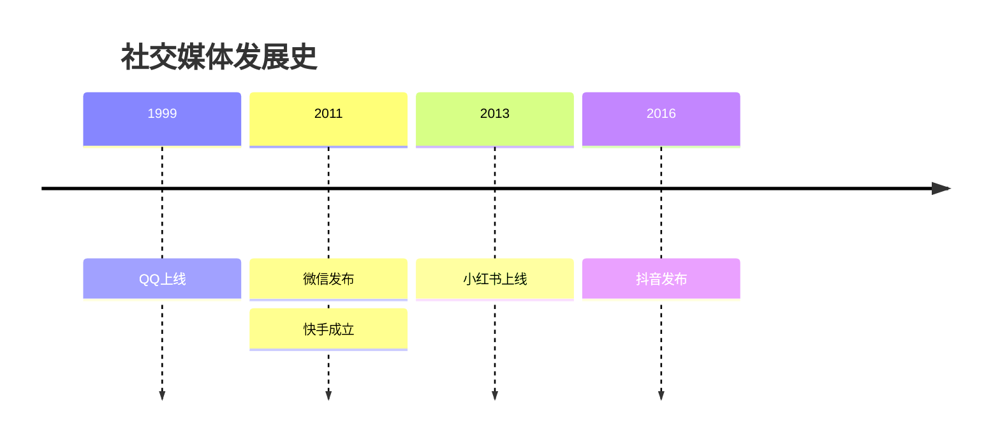

佛教

内容纲要
- 印度早期文明和历史（佛教之前）
- 佛教产生的背景
- 佛教的核心思想
- 佛教的传播
- 东方分支（重点介绍在中国情况）
- 佛教的后期发展和印度教

## 核心教义
包括（但是不限于）
- 三法印
- 四圣谛
- 

### 三法印
佛教试图证明的命题：三法印
- 无常
- 无我
- 涅槃寂静

这三个命题事实上是层层递进的关系，并不是并列的关系，也就是：
先证明无常；再证明无我；最后证明涅槃寂静。
用现在的语言解释这个递进关系就是（逻辑推理过程为）：无常-无我-涅槃寂静 = 知道无常-破除我执着-达到涅槃圆满 = 永恒变化 - 世界虚无 - 心理解脱

为什么？佛教要指明“三法印”？印字是什么意思？
因为：
任何的佛教思想或者经书，无论它是怎么描述的（即便有“如是我闻”，“佛陀当年曾经这么说过”），如果它违背了“三法印”的教义，都不属于佛法。不能被盖章承认，因此“印”字就是这个意思，是印证的意思。

如何通过佛教自己搭建的知识体系来证明这些终极命题呢？
佛教的知识/概念体系是什么样的呢？

#### *无常* ：

使用经验论的方法来证明这个观点。通过对身边事物的观察来证明：一起事物都是不停变化的。
无常，指向的是事物的时间属性。
无常还可以分为“外无常”和“内无常”，我看来意义不大，只要知道它是一个时间上的概念/观念就可以了。

进一步，
佛教使用：因缘/缘起，等等概念，从抽象的“理论”层面证明，事物是变化的

#### *无我*

无我，指向事物的本体属性。
意思是所有的事物（包括物质，思想，规则）都没有背后指挥它们的主体。

佛教使用向下拆分的方法来说明这个概念。比如，
         石头 - 沙粒 - 分子 - 原子 - 质子/中子 - 弦 - 后面可能还有
人 - 大脑 - 神经细胞 - 分子
无我，还可以分为“人无我”和“法无我”，我同样认为这也不重要，只要知道它是一个指向本体上的概念就可以了。

进一步，
佛教使用：成就/因缘假合，等等这些概念来抽象的说明这个理论。
更进一步，
既然没有“我”，所有“物质和精神”背后都没有东西主宰，那整个世界都是“空”的

Q：提出整个观念/命题的背景是什么？
A：佛教诞生之前的“吠陀教”/婆罗门教和之后的印度教（扩展到世界的其它主流宗教：基督教/伊斯兰教/犹太教），都认为“物质/精神”的背后都有非常神秘的力量控制这它们的运行，这个主宰的力量就是“神”，它们把它人格化，就是“上帝”/“弥赛亚”/“梵”。
然而，佛教为了反对“婆罗门”的至高无上（/或者叫装神弄鬼），提出了朴素的哲学/科学观点，指出世界上没有“神”。因此这个背后是一个“无神论”的声明。

#### *涅槃寂静*
这是被佛祖实证的事实？所以信徒才相信？还是过程中，很多信徒/僧侣也达到了这个状态（其它佛/果位等级），所以信徒才相信和向往。信徒追求达到那个“更幸福的状态”，这个状态可能是心理上/哲学上的/世界观上的，而非物质上的。
涅槃寂静的含义：“涅槃”=“烦恼的停止”；“寂静”=“状态是安稳的”。
因此，涅槃是一种状态。是特指“贪嗔痴”的彻底熄灭，并非肉体死亡，因此涅槃有一种是肉体还在的涅槃（有余涅槃），还有另一种肉身消失的涅槃（无余涅槃）
另外，寂静是一个形容词，用来修饰“涅槃”这个表示状态的名词。我理解是外界的影响，不会对内心产生任何的缘起，也就是不会导致内心的任何“波澜”。如平静的水面，即便丢入多少石块，也激不起一丝涟漪，保持一片死寂。

#### 参考 - 上面提到/用到的一些概念

“缘起” 是总法则，是一种理论。简单理解为：此有故彼有，此生故彼生。这个普遍规律。
缘起理论，由下面的一些概念构成。

“因缘” 是缘起的组成单元。可以理解为“关系”。
“十二因缘”
又称为，十二缘起支。似乎可以简单的理解成“关系”。它们互相为因果，一个因缘升起，也会导致另一个因缘也升起。“此有故彼有，此灭故必灭”

“十一意义”/“十一义”
它是用来解释/总结“缘起”理论的特征的。归纳起来缘起理论有几个特点
- 无神/无造物主
- 无常
- 无我
- 所有缘起本质上都是因果关系

#### 时代背景
原始佛教诞生于“沙门思潮”时期，目的是对抗当时的“婆罗门教”，反对基于婆罗门的种姓制度下的：地位/权力/话语权/等等 的不平等，来提出的解放和自由的思想。

#### 三法印的总结

证明的过程：（Critical-Thinking：为什么这三个是核心命题？为什么要证明它们）

